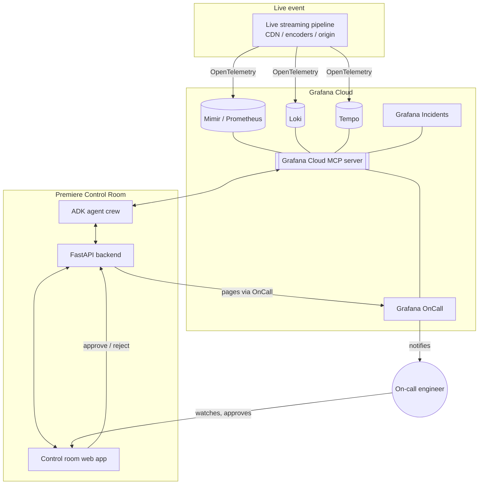
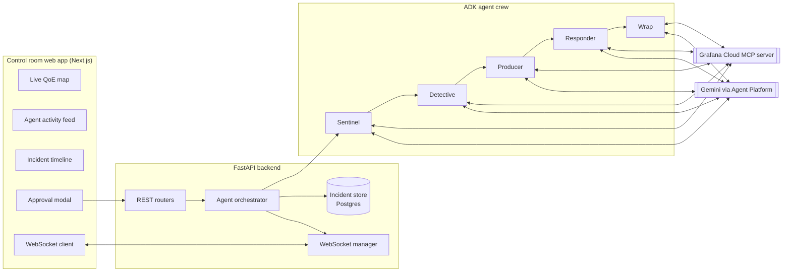

# High-Level Design (HLD)

## Actors and external systems

| Actor / system | Role |
|---|---|
| Live streaming pipeline (synthetic for demo) | Emits OpenTelemetry metrics, logs, and traces representing CDN/encoder/origin behavior |
| Grafana Cloud | Stores telemetry (Mimir/Prometheus, Loki, Tempo) and hosts Alerting, Incidents, OnCall |
| Grafana Cloud MCP server | Exposes 60+ tools over metrics/logs/traces/dashboards/alerting/incidents/OnCall |
| ADK agent crew | Five Gemini-backed agents that detect, diagnose, brief, remediate, and document |
| FastAPI backend | Orchestrates the crew, persists incident state, serves REST + WebSocket |
| Control room web app | Real-time dashboard: live QoE map, agent feed, incident timeline, approval modal |
| On-call engineer / Studio Head | Human approver, paged via Grafana OnCall |

## System context diagram

## Container diagram

## Technology stack

| Layer | Technology |
|---|---|
| Frontend | Next.js 14 (React, TypeScript), Tailwind CSS, native WebSocket client |
| Backend API | FastAPI (Python 3.11+), Uvicorn, Pydantic v2 |
| Agent runtime | Google Agent Development Kit (`google-adk`) |
| LLM | Gemini via Gemini Enterprise Agent Platform / Vertex AI |
| Observability integration | Grafana Cloud MCP server (`grafana/mcp-grafana`, or hosted `mcp.grafana.com`) |
| Persistence | PostgreSQL (Cloud SQL) in prod, SQLite for local/demo |
| Realtime transport | WebSocket (native FastAPI) |
| Paging / incidents | Grafana OnCall + Grafana Incidents (via MCP write tools) |
| Deployment | Cloud Run (frontend + backend); Vertex AI Agent Engine optional for the agent crew |
| Agent self-observability (optional bonus) | Grafana Cloud AI Observability (OpenTelemetry) |

See [`low-level-design.md`](low-level-design.md) for the incident state machine, sequence diagrams, and data model.
