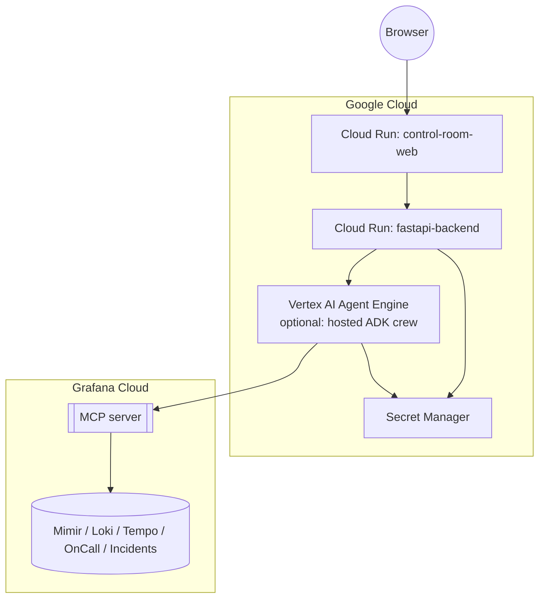

# Deployment Architecture



## Environment variables

| Variable | Used by | Description |
|---|---|---|
| `GRAFANA_URL` | backend | Grafana Cloud stack URL, e.g. `https://<stack>.grafana.net` |
| `GRAFANA_MCP_ENDPOINT` | backend | Self-hosted `mcp-grafana` URL (what `infra/scripts/deploy-mcp-grafana.sh` deploys -- the only option that works headlessly) or `https://mcp.grafana.com/mcp` (hosted, interactive-OAuth-only; see [`agents.md`](agents.md#grafana-mcp-tool-access)) |
| `GRAFANA_SERVICE_ACCOUNT_TOKEN` | backend + mcp-grafana | This backend's credential for Grafana's dashboard-render API; also mcp-grafana's own credential for calling Grafana, if self-hosting it |
| `GRAFANA_MCP_SERVER_TOKEN` | backend (self-hosted mcp-grafana only) | Caller-auth token this backend presents to the self-hosted MCP server; generated automatically by `deploy-mcp-grafana.sh` |
| `GOOGLE_GENAI_USE_VERTEXAI` | backend | `true` (default on Cloud Run) authenticates to Gemini via Vertex AI using the backend service account's Application Default Credentials -- no API key needed. `false` (with `GOOGLE_API_KEY` set) uses the Gemini Developer API instead |
| `GOOGLE_CLOUD_PROJECT` | backend | Vertex AI project (required when `GOOGLE_GENAI_USE_VERTEXAI=true`) |
| `GOOGLE_CLOUD_LOCATION` | backend | Vertex AI region, e.g. `us-central1` |
| `GOOGLE_API_KEY` | backend | Only needed if using the Gemini Developer API instead of Vertex AI |
| `GEMINI_MODEL` | backend | e.g. `gemini-flash-latest` |
| `DATABASE_URL` | backend | Postgres connection string (SQLite for local dev) |
| `DEMO_MODE` | backend | Enables `/api/simulate/inject-anomaly` |
| `SENTINEL_POLL_INTERVAL_SECONDS` | backend | Background Sentinel polling interval, default `15` (only runs once real credentials are configured -- see [`agents.md`](agents.md#sentinel-background-polling-loop)) |
| `SENTINEL_SLO_THRESHOLDS_JSON` | backend | Optional JSON list of `{metric_name, threshold, region}` to poll; defaults to a built-in set covering all five playbook metrics |
| `SIMULATE_LIVE_PIPELINE` | backend | Enables the synthetic OpenTelemetry pipeline (default `true`) -- see [`agents.md`](agents.md#synthetic-live-streaming-pipeline) |
| `OTEL_EXPORTER_OTLP_ENDPOINT` | backend | Standard OTel env var; point it at Grafana Cloud's OTLP gateway (or a local collector) to export real telemetry. Unset = console export only |
| `OTEL_EXPORTER_OTLP_HEADERS` | backend | Standard OTel env var for OTLP auth, e.g. `Authorization=Basic <base64 instance_id:api_key>` for Grafana Cloud |
| `JWT_SECRET` | backend | Signs auth tokens; set explicitly for multi-instance or restart-persistent deployments (see [`security.md`](security.md)) |
| `JWT_EXPIRY_MINUTES` | backend | Access token lifetime, default `480` (8h) |
| `ADMIN_EMAIL` / `ADMIN_PASSWORD` | backend | Bootstrap admin account, created once if no users exist. Random password generated + logged once if unset |
| `NOTIFICATION_WEBHOOK_URLS` | backend | Comma-separated webhook URLs (Slack incoming webhooks work directly) notified on approval-needed/escalation/resolved -- see [`agents.md`](agents.md#escalation-and-notifications) |
| `ESCALATION_TIMEOUT_SECONDS` | backend | Re-notify if a high-risk remediation is still awaiting approval after this long, default `300` |
| `NEXT_PUBLIC_WS_URL` | frontend | WebSocket endpoint the browser connects to |

Both `fastapi-backend` and `control-room-web` deploy as independent Cloud Run services, each running as its own dedicated, least-privilege service account (`premiere-backend`, `premiere-frontend`) rather than the shared Compute Engine default service account -- see [`infra/scripts/README.md`](https://github.com/akashtalole/Continuity-Premiere-Control-Room-Agents/blob/main/infra/scripts/README.md#service-accounts) for exactly what each is granted. The agent crew runs in-process inside the backend by default; `Vertex AI Agent Engine` is an optional deployment target if the crew needs to scale or be hosted independently of the API layer. All secrets (Grafana tokens, an optional Gemini API key) are sourced from Secret Manager at runtime — see [`security.md`](security.md). Gemini access itself doesn't need a stored secret at all: the backend service account authenticates to Vertex AI directly via Application Default Credentials.

## Deploying from Google Cloud Shell

`infra/scripts/deploy-all.sh` automates the whole thing — enabling APIs, creating the three service accounts and granting their IAM roles (including a fix for a common Cloud Build source-upload permission gap on new projects), deploying the self-hosted Grafana MCP server if `GRAFANA_URL` is set, building both app images via Cloud Build, deploying both Cloud Run services, and wiring their URLs into each other (the backend's URL into the frontend's `NEXT_PUBLIC_API_URL` build arg, then the frontend's real URL back into the backend's `CORS_ORIGINS`). Run it from [Cloud Shell](https://cloud.google.com/shell):

```bash
git clone https://github.com/akashtalole/Continuity-Premiere-Control-Room-Agents.git
cd Continuity-Premiere-Control-Room-Agents
gcloud config set project <YOUR_PROJECT_ID>
bash infra/scripts/deploy-all.sh
```

With no other environment variables set, this deploys the real Gemini crew via Vertex AI (no API key required) with the deterministic mock crew still standing in for the Grafana side until `GRAFANA_URL` is provided — a fully functional live demo URL in a few minutes either way. See [`infra/scripts/README.md`](https://github.com/akashtalole/Continuity-Premiere-Control-Room-Agents/blob/main/infra/scripts/README.md) for connecting real Grafana Cloud MCP credentials, using a Gemini API key instead of Vertex AI, provisioning Cloud SQL for real persistence (the default SQLite is ephemeral on Cloud Run), enabling real OTLP export, and tearing everything down afterward.

Each app also ships its own `Dockerfile` (`backend/Dockerfile`, `frontend/Dockerfile`) if you'd rather drive `gcloud builds submit` / `gcloud run deploy` by hand; `infra/cloudrun-backend.yaml` and `infra/cloudrun-frontend.yaml` document the equivalent declarative Cloud Run service manifests (`gcloud run services replace <file> --region <region>`), though the scripts under `infra/scripts/` are the tested, maintained path.
