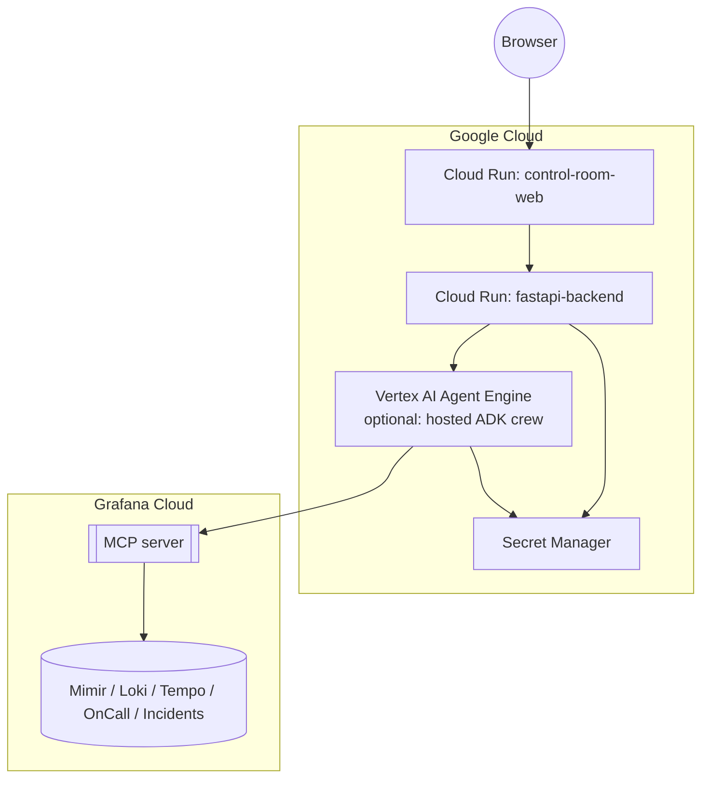

# Deployment Architecture



## Environment variables

| Variable | Used by | Description |
|---|---|---|
| `GRAFANA_URL` | backend | Grafana Cloud stack URL, e.g. `https://<stack>.grafana.net` |
| `GRAFANA_MCP_ENDPOINT` | backend | `https://mcp.grafana.com/mcp` (hosted) or local `mcp-grafana` address |
| `GRAFANA_SERVICE_ACCOUNT_TOKEN` | backend (unattended mode only) | Required only if self-hosting `mcp-grafana` |
| `GOOGLE_CLOUD_PROJECT` | backend | Vertex AI / Agent Platform project |
| `GEMINI_MODEL` | backend | e.g. `gemini-flash-latest` |
| `DATABASE_URL` | backend | Postgres connection string (SQLite for local dev) |
| `DEMO_MODE` | backend | Enables `/api/simulate/inject-anomaly` |
| `SENTINEL_POLL_INTERVAL_SECONDS` | backend | Background Sentinel polling interval, default `15` (only runs once real credentials are configured -- see [`agents.md`](agents.md#sentinel-background-polling-loop)) |
| `SENTINEL_SLO_THRESHOLDS_JSON` | backend | Optional JSON list of `{metric_name, threshold, region}` to poll; defaults to a built-in set covering all five playbook metrics |
| `SIMULATE_LIVE_PIPELINE` | backend | Enables the synthetic OpenTelemetry pipeline (default `true`) -- see [`agents.md`](agents.md#synthetic-live-streaming-pipeline) |
| `OTEL_EXPORTER_OTLP_ENDPOINT` | backend | Standard OTel env var; point it at Grafana Cloud's OTLP gateway (or a local collector) to export real telemetry. Unset = console export only |
| `OTEL_EXPORTER_OTLP_HEADERS` | backend | Standard OTel env var for OTLP auth, e.g. `Authorization=Basic <base64 instance_id:api_key>` for Grafana Cloud |
| `NEXT_PUBLIC_WS_URL` | frontend | WebSocket endpoint the browser connects to |

Both `fastapi-backend` and `control-room-web` deploy as independent Cloud Run services. The agent crew runs in-process inside the backend by default; `Vertex AI Agent Engine` is an optional deployment target if the crew needs to scale or be hosted independently of the API layer. All secrets (Grafana tokens, Google Cloud credentials) are sourced from Secret Manager at runtime — see [`security.md`](security.md).

## Deploying from Google Cloud Shell

`infra/scripts/deploy-all.sh` automates the whole thing — enabling APIs, building both images via Cloud Build, deploying both Cloud Run services, and wiring their URLs into each other (the backend's URL into the frontend's `NEXT_PUBLIC_API_URL` build arg, then the frontend's real URL back into the backend's `CORS_ORIGINS`). Run it from [Cloud Shell](https://cloud.google.com/shell):

```bash
git clone https://github.com/akashtalole/Agentic-Cinema-The-Blockbuster-Hackathon.git
cd Agentic-Cinema-The-Blockbuster-Hackathon
gcloud config set project <YOUR_PROJECT_ID>
bash infra/scripts/deploy-all.sh
```

With no other environment variables set, this deploys the backend on the deterministic mock crew (no Gemini/Grafana credentials required) — a fully functional live demo URL in a few minutes. See [`infra/scripts/README.md`](../infra/scripts/README.md) for connecting real Grafana Cloud MCP + Gemini credentials, provisioning Cloud SQL for real persistence (the default SQLite is ephemeral on Cloud Run), enabling real OTLP export, and tearing everything down afterward.

Each app also ships its own `Dockerfile` (`backend/Dockerfile`, `frontend/Dockerfile`) if you'd rather drive `gcloud builds submit` / `gcloud run deploy` by hand; `infra/cloudrun-backend.yaml` and `infra/cloudrun-frontend.yaml` document the equivalent declarative Cloud Run service manifests (`gcloud run services replace <file> --region <region>`), though the scripts under `infra/scripts/` are the tested, maintained path.
