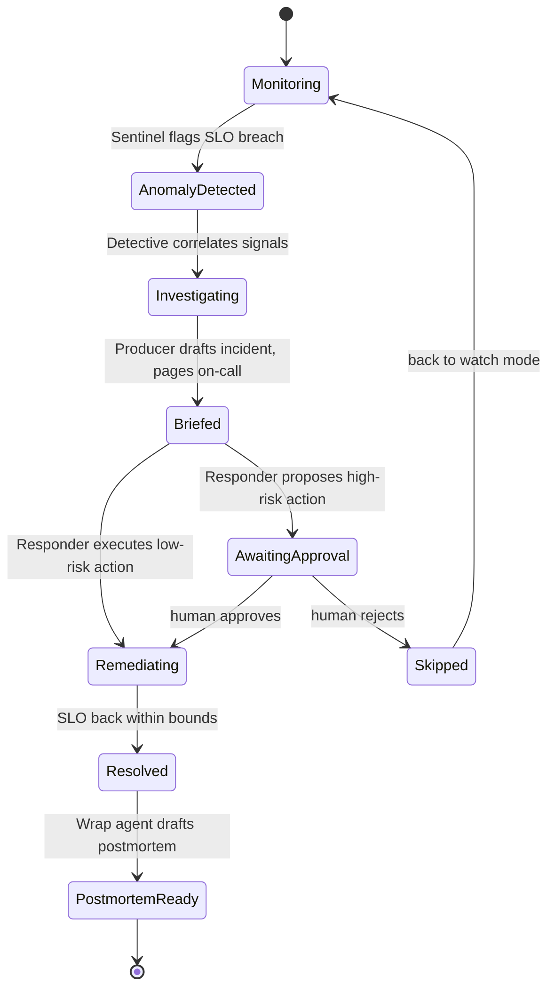
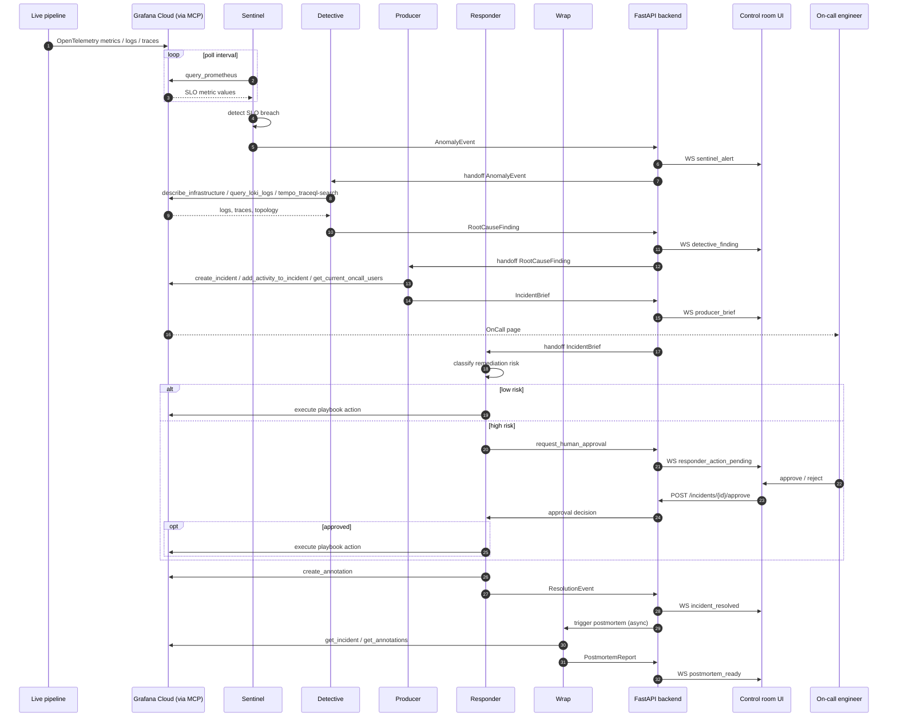
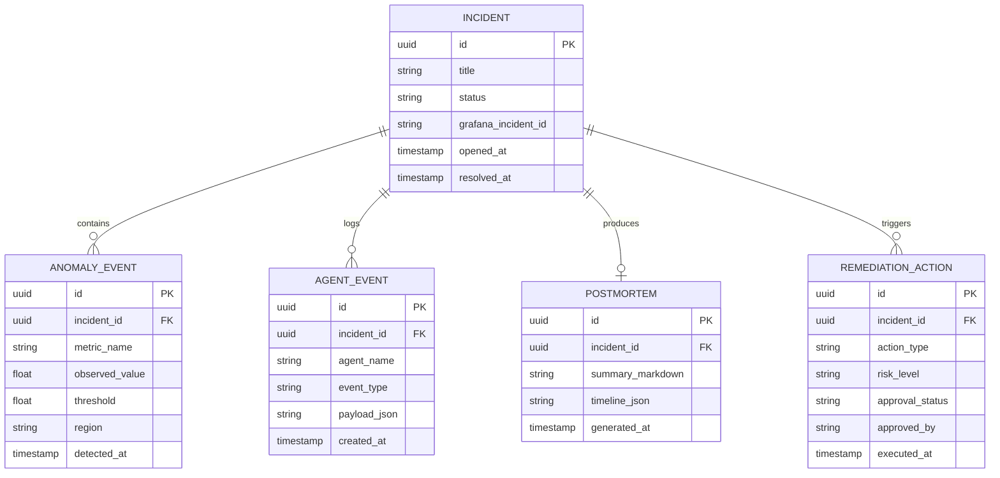

# Low-Level Design (LLD)

## Incident lifecycle — state machine



## Full incident sequence



## Persisted data model



## Pydantic schemas (`backend/app/models/schemas.py`)

```python
from datetime import datetime
from enum import Enum
from typing import Any, Literal
from uuid import UUID, uuid4

from pydantic import BaseModel, Field


class IncidentStatus(str, Enum):
    monitoring = "monitoring"
    anomaly_detected = "anomaly_detected"
    investigating = "investigating"
    briefed = "briefed"
    awaiting_approval = "awaiting_approval"
    remediating = "remediating"
    resolved = "resolved"
    postmortem_ready = "postmortem_ready"
    skipped = "skipped"


class AnomalyEvent(BaseModel):
    id: UUID = Field(default_factory=uuid4)
    metric_name: str
    observed_value: float
    threshold: float
    region: str
    detected_at: datetime = Field(default_factory=datetime.utcnow)


class RootCauseFinding(BaseModel):
    summary: str
    confidence: float
    upstream_services: list[str]
    supporting_trace_ids: list[str]
    supporting_log_query: str


class IncidentBrief(BaseModel):
    grafana_incident_id: str
    title: str
    plain_language_summary: str
    severity: Literal["sev1", "sev2", "sev3"]
    oncall_user: str | None = None


class RemediationAction(BaseModel):
    action_type: str
    risk_level: Literal["low", "high"]
    description: str
    approval_status: Literal["not_required", "pending", "approved", "rejected"] = "not_required"
    approved_by: str | None = None
    executed_at: datetime | None = None


class PostmortemReport(BaseModel):
    summary_markdown: str
    timeline: list[dict[str, Any]]
    generated_at: datetime = Field(default_factory=datetime.utcnow)


class AgentEventEnvelope(BaseModel):
    """Wire format for every WebSocket push to the control room UI."""

    type: Literal[
        "sentinel_alert",
        "detective_finding",
        "producer_brief",
        "responder_action_pending",
        "responder_action_executed",
        "incident_resolved",
        "postmortem_ready",
    ]
    incident_id: UUID
    agent: Literal["sentinel", "detective", "producer", "responder", "wrap"]
    timestamp: datetime = Field(default_factory=datetime.utcnow)
    payload: dict[str, Any]
```

## Grafana MCP tool mapping

| Agent | MCP tools used | Access level |
|---|---|---|
| Sentinel | `query_prometheus`, `query_prometheus_histogram`, `list_alert_groups` | Read |
| Detective | `describe_infrastructure`, `query_loki_logs`, `query_loki_patterns`, `tempo_traceql-search`, `tempo_get-trace`, `list_prometheus_label_values` | Read |
| Producer | `create_incident`, `add_activity_to_incident`, `get_current_oncall_users`, `list_oncall_schedules`, `generate_deeplink` | Read + Write (incidents) |
| Responder | `alerting_manage_rules`, `create_annotation`, `get_panel_image` | Read + Write (gated by human approval) |
| Wrap | `get_incident`, `get_annotations`, `get_dashboard_summary` | Read |

See [`mcp-tool-reference.md`](mcp-tool-reference.md) for the full tool-by-tool reference and [`agents.md`](agents.md) for how each agent is wired to the shared MCP toolset.

## Remediation playbook table

The Responder doesn't always propose the same action. `app/adk_agents/playbooks.py` maps the breaching metric to a specific action and risk tier, so the orchestrator and mock crew (and, by instruction, the real Responder agent) all pick consistently:

| Metric | Action | Risk | Behavior |
|---|---|---|---|
| `encoder_queue_depth` | `scale_encoder_capacity` | low | Executes directly -- Briefed → Remediating, no approval hop |
| `cache_hit_ratio` | `purge_cdn_cache` | low | Executes directly |
| `rebuffer_ratio` | `cdn_regional_failover` | high | Blocks on `request_human_approval` |
| `origin_error_rate` | `purge_cdn_cache` | high | Blocks on `request_human_approval` |
| `playback_failure_rate` | `rollback_bad_deploy` | high | Blocks on `request_human_approval` |

Any metric not in the table falls back to the `rebuffer_ratio` playbook. The orchestrator consults this table *before* invoking the Responder, so it only shows the approval-pending UI state and sets Sentinel-through-Wrap agent status to `blocked` for high-risk actions -- low-risk ones go straight to `remediating`.

## Concurrent incidents

Multiple incidents can be in flight at once: `Orchestrator.start_incident` fires an independent `asyncio.Task` per incident, so nothing serializes them. Two things had to change to make that safe rather than merely possible:

- **Agent status** (`app/services/agent_status.py`) tracks, per agent, the *set* of incident IDs it's currently working rather than a single `current_incident_id` -- otherwise a second incident reaching "Detective" would silently overwrite the first's status. `GET /api/agents/status` reports `active_incidents: [...]` per agent, and the agent's overall `state` is `blocked` if any of its active incidents are blocked, else `running`.
- **The control room UI** queues approval requests instead of replacing one pending approval with the next (see [`frontend.md`](frontend.md)), and the "Inject 3 concurrent anomalies" demo button exists specifically to exercise this path.

The one place concurrency isn't free is the demo SQLite database, which serializes writes under load; this is fine for a hackathon demo's incident volume; see [`deployment.md`](deployment.md) for switching to Postgres in production.
