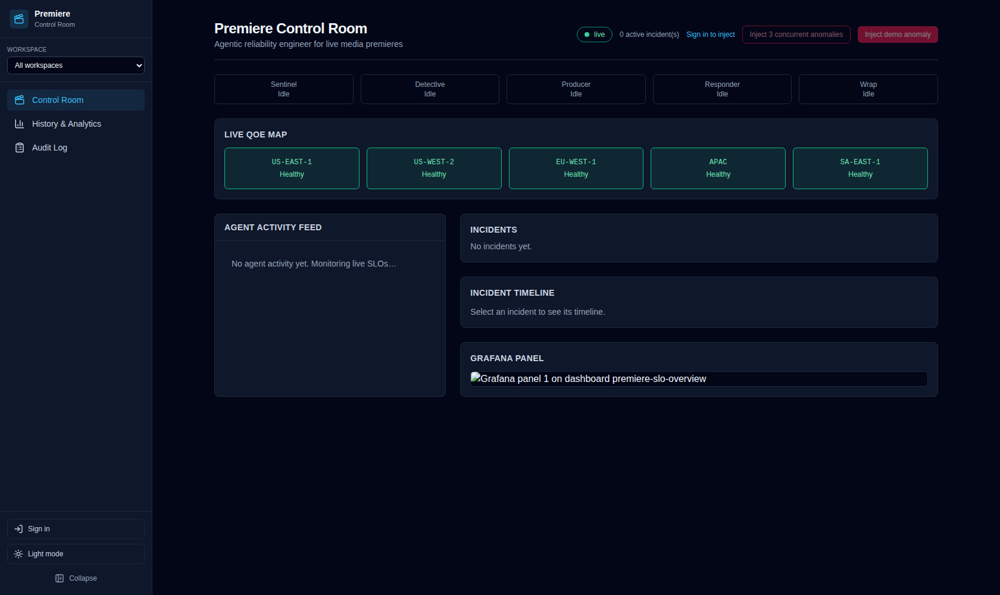
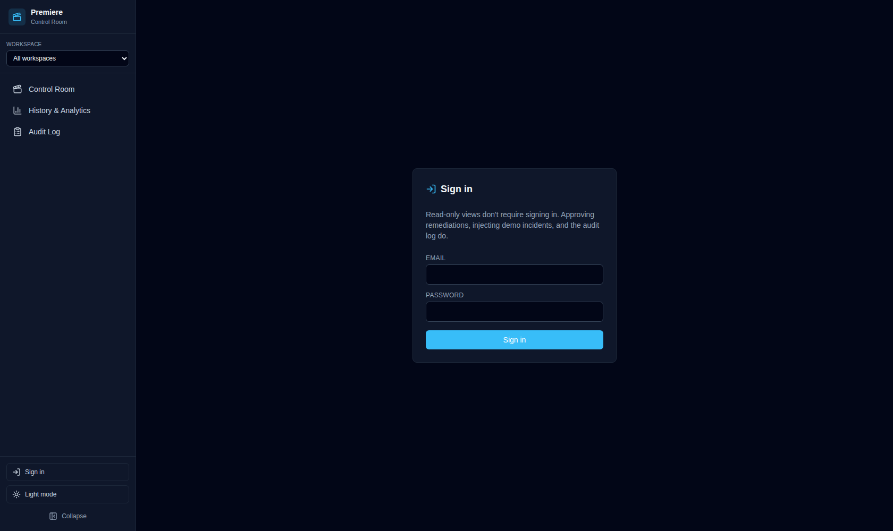
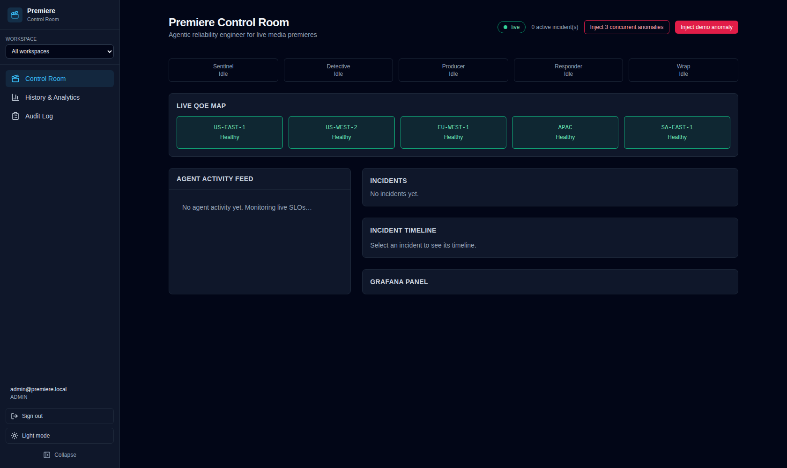
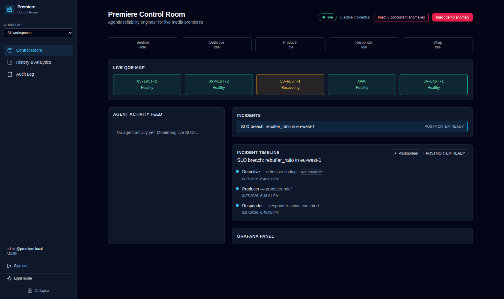
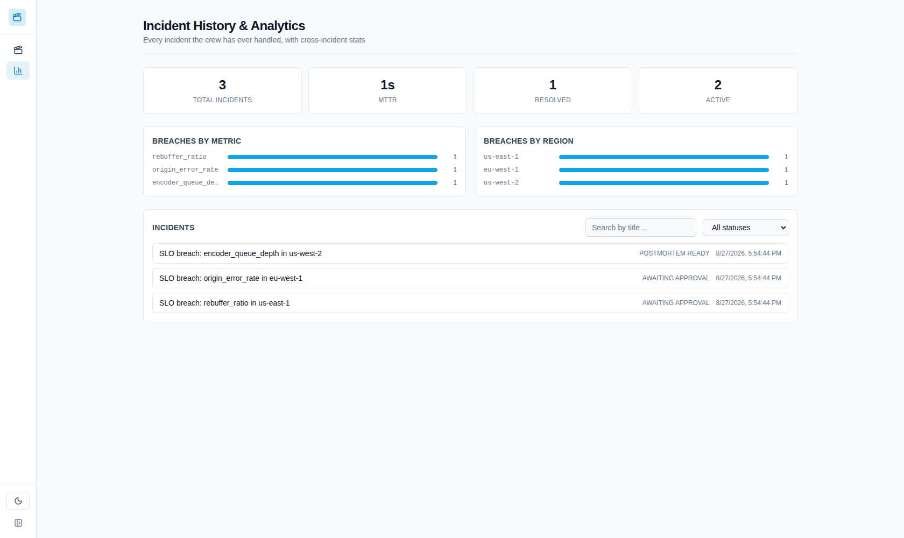
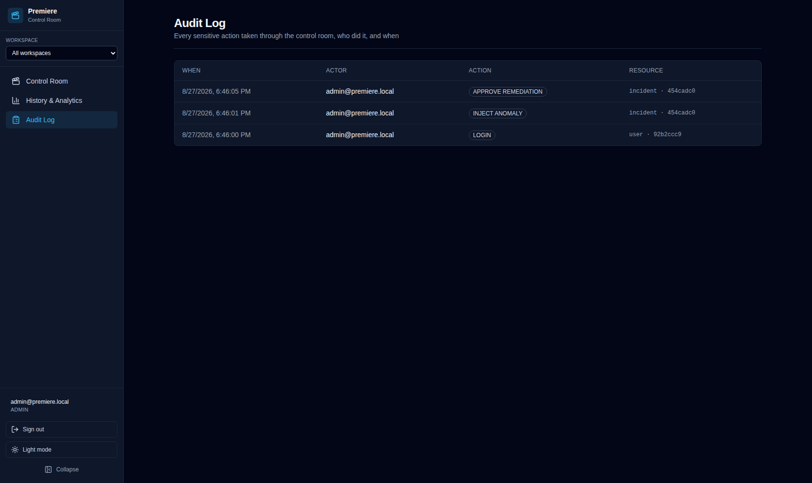

# User Guide

This walks through the control room as a signed-out viewer, then as a signed-in operator driving an incident end to end. Screenshots are from the deterministic mock crew, which behaves identically to the real Gemini + Grafana crew from the UI's point of view.

## The control room, signed out

Opening the app lands you on the control room — the live agent-status bar, the QoE map by region, the agent activity feed, and the incident list. This is a read-only view on purpose: no sign-in is required to watch what the crew is doing.

Notice the **Inject** buttons are disabled and there's a "Sign in to inject" link — taking any action (injecting a demo incident, approving/rejecting a remediation) requires an account. Watching does not.

## Signing in

Click **Sign in** in the sidebar (or the "Sign in to inject" link) to reach the login page.

If you don't have an account yet, ask an admin to create one for you, or — for your own local/first deployment — use the bootstrap admin account created on first startup (see [Setup Guide → Signing in](setup-guide.md#backend) for where to find its password).

### Roles

Three tiers, each a superset of the one before it:

| Role | Can do |
|---|---|
| **viewer** | Everything unauthenticated users can already do (the control room and history are public) — this tier exists for future read-gated routes |
| **operator** | Approve/reject remediations, inject demo anomalies, trigger chaos |
| **admin** | Everything operator can, plus creating/revoking users and creating workspaces |

Once signed in, the sidebar shows your email and role, with a **Sign out** button below it.

## Driving an incident

With an operator (or admin) account, the two red buttons in the header become active:

- **Inject demo anomaly** — starts one incident with a random metric/region combination.
- **Inject 3 concurrent anomalies** — starts three at once, useful for seeing the crew and UI handle overlapping incidents (each agent tracks state per-incident, not globally).

Clicking either drives the full crew loop: **Sentinel** flags the breach, **Detective** investigates (checking whether this metric has broken before and citing that precedent if so), **Producer** writes an incident brief, and **Responder** either executes a low-risk fix immediately or — for a high-risk action — blocks and asks for your approval.

### Approving or rejecting

A high-risk remediation surfaces a modal with the proposed action and its description. **Approve** or **Reject** — either way the incident continues to a postmortem; a rejected action is recorded as skipped rather than executed. If you're not signed in as an operator, the buttons are disabled with a prompt to sign in.

If nobody responds within a few minutes, the crew sends a second notification (webhook/Slack, if configured) rather than waiting on you indefinitely — see [Agent Layer → Escalation and notifications](agents.md#escalation-and-notifications).

### Reading the incident timeline

Select any incident from the list to see its full timeline: which agent did what and when, the Detective's confidence in its root-cause hypothesis, and — once the postmortem is ready — a one-click markdown download and a running total of Gemini token usage for that incident.

## History & Analytics

The **History & Analytics** page lists every incident the crew has ever handled, with cross-incident stats: total count, mean time to resolution, breach frequency by metric and by region, and — once the real Gemini crew has run — fleet-wide token usage and an estimated cost. Search and filter by status, and expand any incident to read (or download) its postmortem.

## Audit Log

Every sensitive action — signing in, approving or rejecting a remediation, injecting an anomaly, user/workspace management — is recorded with the real actor's email, the action, and a timestamp. Visible to any signed-in operator or admin under **Audit Log** in the sidebar.

An approved remediation's recorded approver is always the person who actually clicked Approve — never something an LLM's own output happened to write for that field. See [Security & Governance](security.md) for the full reasoning.

## Workspaces

If your deployment has more than one workspace (separate productions, events, or teams sharing one control room), a **Workspace** switcher appears at the top of the sidebar. Selecting one filters the control room and history views down to that workspace's incidents; "All workspaces" shows everything. Injecting a new anomaly always tags it with your own account's workspace — you can't inject into a workspace you don't belong to.

## Appearance

The sidebar's theme toggle switches between light and dark mode (it remembers your choice, and otherwise follows your system setting). The **Collapse** button shrinks the sidebar to icons-only for more screen space — also remembered across visits.
